# semantic-segmentation
Fully Convolutional Network for Semantic Segmentation

The network will be trained to identify all pixels in an image that belong to the road.

## Setup

### Frameworks and Packages

Make sure you have the following is installed:

 - [Python 3](https://www.python.org/)
 - [TensorFlow](https://www.tensorflow.org/)
 - [NumPy](http://www.numpy.org/)
 - [SciPy](https://www.scipy.org/)

### Folder Structure

Create sub-folder `data`. 

### Dataset

Download the [Kitti Road dataset](http://www.cvlibs.net/datasets/kitti/eval_road.php) from [here](http://www.cvlibs.net/download.php?file=data_road.zip).  Extract the dataset in the `data` folder.  This will create the folder `data_road` with all the training a test images.

## Contents of the submission
 - `main.py`
 - `main.ipynb` (some more experimental code)
 - `helper.py`
 - `project_tests.py`
 - this `README.md`

## Implementation

First of all, I inspected the data and the helper functions provided in `helper.py`. For this, I set up a Jupyter notebook, `main.ipynb`, wich contains most of the final version of `main.py` with a slightly different structure. And, of course, some code for inspecting the image data, the pre-trained VGG16 network etc. 

The VGG16 network is extended to a FCN using following layers:
 - adding five transpose convolutions with 'same' padding to scale the final layer from VGG16 up to the original image size
 - adding two skip connections, from VGG16 layer 4 to the first deconvolution, and from VGG16 layer 3 to the second deconvolution
 - Increasing the kernel size from 2x2 for the first deconvolution layer with 512 channel, up to 24x24 for the last deconvolution layer with two output channels. Increasing the kernel sizes in this way improved the results a lot as compared to 2x2 or 3x3 kernels.
 - ReLU activations for deconv layers 1-3, softsign for deconv 4; for some reason, ReLU on deconv layer 4 caused a memory problem starting from epoch 2 (not epoch 1... ??) on my NVidia GTX1060 with 6GB RAM.

## Results

Please find some nice images in the `examples` folder:

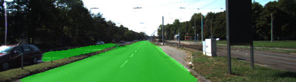

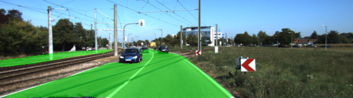

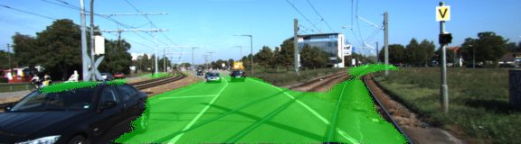

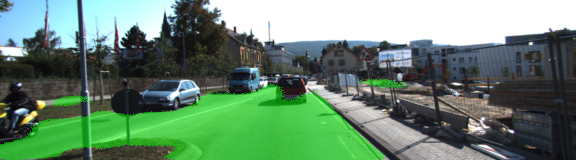

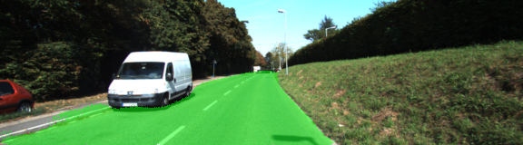

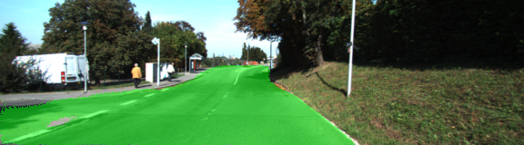

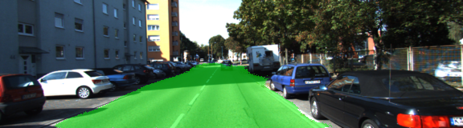

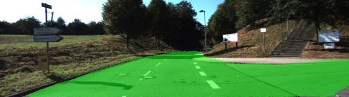

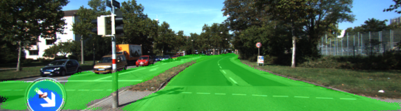

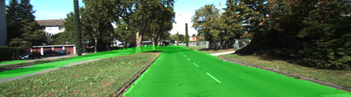

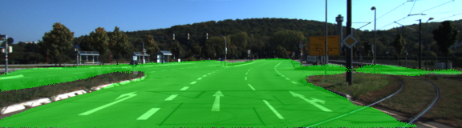

